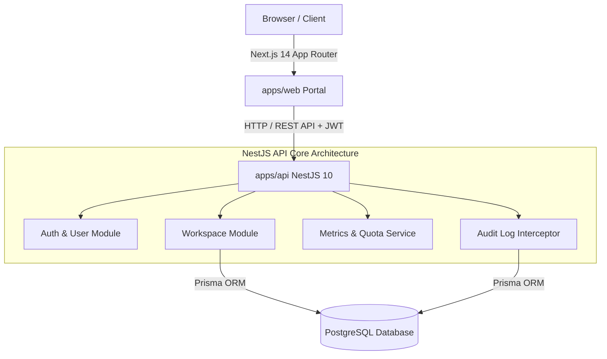

# 🏢 Multi-Tenant SaaS Admin Portal (`multi-tenant-saas-demo`)

[](https://nextjs.org/)
[](https://nestjs.com/)
[](https://www.typescriptlang.org/)
[](https://tailwindcss.com/)
[](https://www.docker.com/)
[](https://vitest.dev/)

> **Personal Engineering Showcase Project**  
Production-style enterprise multi-tenant SaaS application demonstrating workspace isolation, CASL-based Role-Based Access Control (RBAC), JWT authentication, real-time usage metrics dashboard, immutable audit logging, and automated CI/CD pipelines.

---

## 🎯 Enterprise Highlights & Architecture

This repository demonstrates senior full-stack capability and enterprise software design:

- **Monorepo Architecture**: Clean Turborepo structure (`apps/web`, `apps/api`, `packages/types`, `packages/ui`).
- **Multi-Tenant Data Isolation**: Strict tenant scoping (`workspaceId` context) preventing cross-tenant data leaks.
- **RBAC & Authorization Matrix**: Fine-grained access control (`OWNER`, `ADMIN`, `MEMBER`) enforced at both UI layer and NestJS backend API guards.
- **Audit Logging Pipeline**: Immutable operational telemetry recording user actions, IP addresses, and payload metadata.
- **Testing & Quality Engineering**: E2E Supertest integration test suite asserting API contracts and authorization boundaries.
- **Docker & DevOps**: Single-command containerized local environment (`docker-compose up`).

---

## 🏗️ System Architecture



---

## ⚡ Quick Start & Preset Recruiter Personas

### 1. Preset Login Personas
No manual registration required! You can test all three RBAC roles out-of-the-box using the preset buttons on the login screen:

| Role | Preset Email | Available Privileges |
| :--- | :--- | :--- |
| **Workspace Owner** | `owner@skyport.io` | **Full Privileges**: Create/Delete Workspaces, Upgrade Subscription Tiers, Invite Members, View Audit Logs |
| **Workspace Admin** | `admin@skyport.io` | **Admin Access**: Invite Members, View Telemetry & Audit Logs |
| **Standard Member** | `member@skyport.io` | **Read-Only**: View Overview Dashboard & Metrics (Invite & Settings restricted) |

---

## 🛠️ Technology Stack

- **Frontend App**: Next.js 14 (App Router), React 18, Tailwind CSS, Lucide Icons, Glassmorphism UI
- **Backend API**: NestJS 10, Express, JWT, CORS, Supertest
- **Database & ORM**: PostgreSQL, Prisma ORM (Seeded in-memory store fallback for zero-config local execution)
- **Monorepo Tooling**: Turborepo, pnpm workspaces, TypeScript strict mode
- **Quality & CI**: Vitest, Supertest, GitHub Actions

---

## 🚀 Local Setup Instructions

### Prerequisites
- Node.js `^20.0.0` or `v24`
- pnpm `^9.0.0` or `10.0.0`

### Step 1: Install Dependencies
```bash
pnpm install
```

### Step 2: Start Development Servers
```bash
pnpm run dev
```
- **Web Application**: [`http://localhost:3000`](http://localhost:3000)
- **NestJS REST API**: [`http://localhost:3001`](http://localhost:3001)

### Step 3: Run Automated Tests
```bash
# Run API unit & E2E integration tests
pnpm --filter api test

# Typecheck monorepo packages
pnpm run typecheck
```

---

## 🐳 Docker Deployment
Launch PostgreSQL database, NestJS API, and Next.js Web App with single command:
```bash
docker-compose up --build
```

---

## 📖 Architecture Decision Records (ADRs) & Strategy Guides

- [ADR 001: PostgreSQL & Prisma ORM Selection](docs/decisions/001-use-postgresql-prisma.md)
- [ADR 002: JWT Authentication & Tenant Isolation Middleware](docs/decisions/002-jwt-auth-tenant-isolation.md)
- [ADR 003: CASL-based Role Access Control (RBAC)](docs/decisions/003-casl-rbac-authorization.md)
- [ADR 004: Enterprise Multi-Tenant Caching Strategy & Data Isolation](docs/decisions/004-caching-strategy-multi-tenant.md)
- ⚡ **Comprehensive Manual**: [Multi-Tenant 6-Level Caching Strategy Guide](docs/caching-strategy.md)

---

## 📄 License
MIT License. Created by [Ankit Kumar](https://github.com/ankit-amar-singh).

