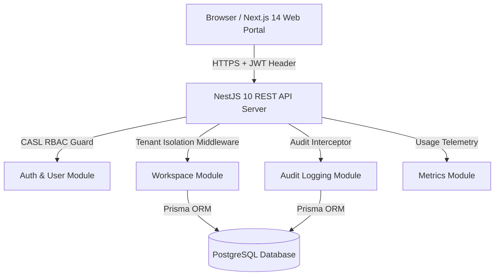

# Multi-Tenant SaaS Platform Architecture

This document details the system design, isolation patterns, authentication flow, and authorization matrix for the `multi-tenant-saas-demo` platform.

---

## 🏗️ High-Level System Architecture

---

## 🔒 Multi-Tenant Isolation Strategy

The platform utilizes **Logical Schema-Level Tenant Isolation** backed by scoped database indexes:

1. **Tenant ID Propagation**:
   - Every API request carries a workspace context (`X-User-Email` header or active JWT workspace payload).
   - Middleware extracts and validates active tenant membership before controller execution.

2. **Database Query Scoping**:
   - Every table model (`Workspace`, `WorkspaceMember`, `AuditLog`) maintains a strict foreign key index on `workspaceId`.
   - All SQL/Prisma operations append `WHERE workspaceId = :tenantId`.

3. **Role-Based Access Control (RBAC)**:
   - **`OWNER`**: Full administrative authority (Workspace rename, tier upgrade, billing, member management, workspace deletion).
   - **`ADMIN`**: Operational control (Invite members, view analytics, inspect audit logs).
   - **`MEMBER`**: Read-only access to overview dashboard and usage metrics.

---

## 📋 Architecture Decision Records (ADRs)

- [ADR 001: Use PostgreSQL & Prisma ORM](decisions/001-use-postgresql-prisma.md)
- [ADR 002: JWT Authentication & Tenant Isolation Middleware](decisions/002-jwt-auth-tenant-isolation.md)
- [ADR 003: CASL-based Role Access Control (RBAC)](decisions/003-casl-rbac-authorization.md)
