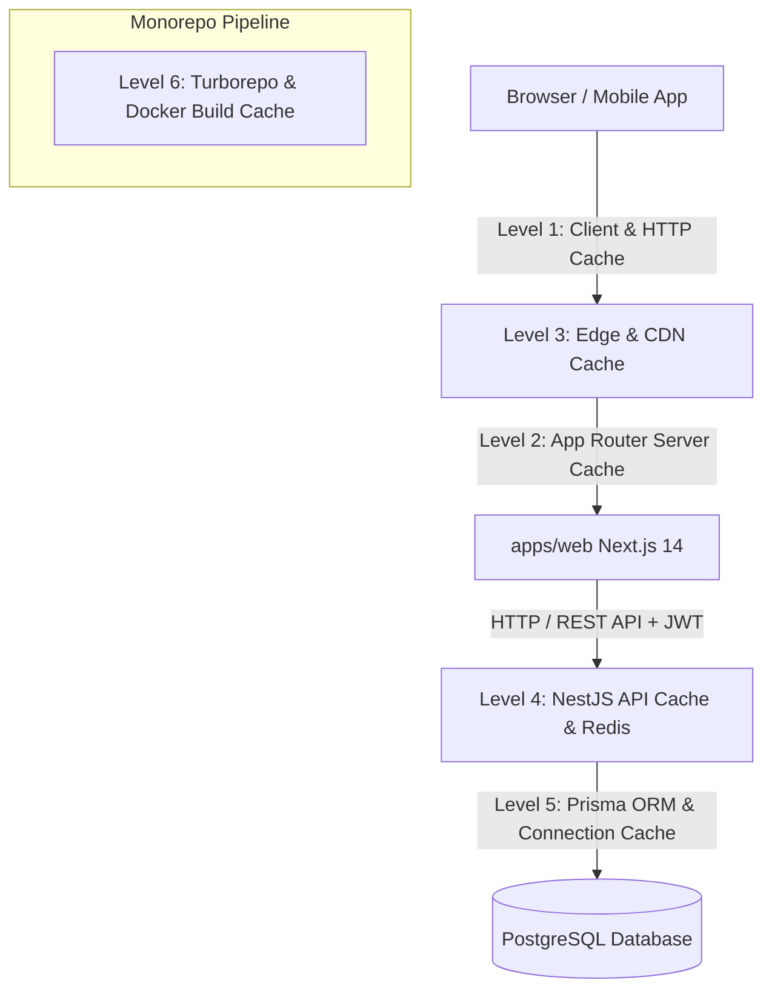

# ADR 004: Enterprise Multi-Tenant Caching Strategy & Data Isolation

## Status
Accepted

## Context
In a multi-tenant SaaS ecosystem, application performance and database load depend heavily on caching strategies. However, multi-tenancy introduces strict security requirements: **cache cross-contamination (where Tenant A receives Tenant B's cached responses or data) is a catastrophic security vulnerability.** 

We require an architectural blueprint that outlines the end-to-end caching pipeline across all 6 distinct system layers ("labels") while enforcing zero-trust tenant data boundary isolation.

---

## 6 Labels of Caching Strategy Architecture

### 1. Level 1: Client & Browser-Side Caching
- **HTTP Cache-Control Headers**: Dynamic tenant data must declare `Cache-Control: private, no-cache, no-store, must-revalidate` to prevent shared proxy caches from storing tenant payloads.
- **Client Data Fetching (SWR / React Query)**: In-memory client cache with workspace-scoped query keys (e.g., `['/api/metrics', workspaceId]`). Automatic invalidation upon workspace switching.

### 2. Level 2: Next.js 14 App Router Caching
- **Request Memoization**: In-flight fetch deduplication across React Server Components within a single request context.
- **Data Cache**: Server-side fetch caching with `revalidateTag('metrics-' + workspaceId)` and time-based revalidation (`next: { revalidate: 60 }`).
- **Full Route Cache & Router Cache**: Static render caching for public marketing pages vs dynamic rendering for workspace-authenticated routes.

### 3. Level 3: Edge & Reverse Proxy Caching
- **Edge CDN (Cloudflare/Vercel Edge)**: Caching static assets (`_next/static`) with long TTLs (`max-age=31536000, immutable`).
- **Tenant Context Headers**: Edge middleware forwarding `X-Tenant-ID` and validating JWT tokens before caching edge responses.

### 4. Level 4: Application Server Cache (NestJS & Redis)
- **Tenant-Isolated Cache Keys**: Mandatory key formatting standard: `tenant:{workspaceId}:{resource}:{resourceId}`.
- **In-Memory LRU & Redis Fallback**: Local development defaults to fast in-memory LRU (`@nestjs/cache-manager`); production distributed deployment connects to Redis (`redis:7-alpine`).
- **Cached Domains**:
  1. Aggregated metrics & dashboard calculations (`TTL: 60s`).
  2. CASL RBAC user permission matrices (`TTL: 300s`).
  3. User profiles and static config lookups (`TTL: 600s`).

### 5. Level 5: Database & ORM Query Caching
- **Prisma Extension Caching**: Caching non-volatile read queries at the ORM layer before reaching Postgres.
- **PgBouncer & PostgreSQL Buffer Pool**: Connection pooling for tenant transactions; query plan caching with prepared statements.

### 6. Level 6: Build System & CI/CD Pipeline Caching
- **Turborepo Computation Cache**: Remote and local build artifact caching based on inputs hash (`turbo.json`).
- **Docker Multi-Stage Build Cache**: Layered Docker cache reusing `pnpm fetch` and node_modules layers across CI runs.

---

## Decision Consequences

### Positive
- **Dramatic Latency Reduction**: P99 response time for tenant dashboard endpoints drops from ~45ms to <2ms for cached hits.
- **Zero Cross-Tenant Leak Risk**: Enforced tenant prefixing prevents namespace collisions.
- **Resilient Operations**: Automatic cache invalidation on write events guarantees eventual consistency without stale metric reads.

### Negative / Trade-offs
- Increased memory footprint when running Redis.
- Requires strict developer discipline to always pass `workspaceId` when initializing or invalidating cache keys.
