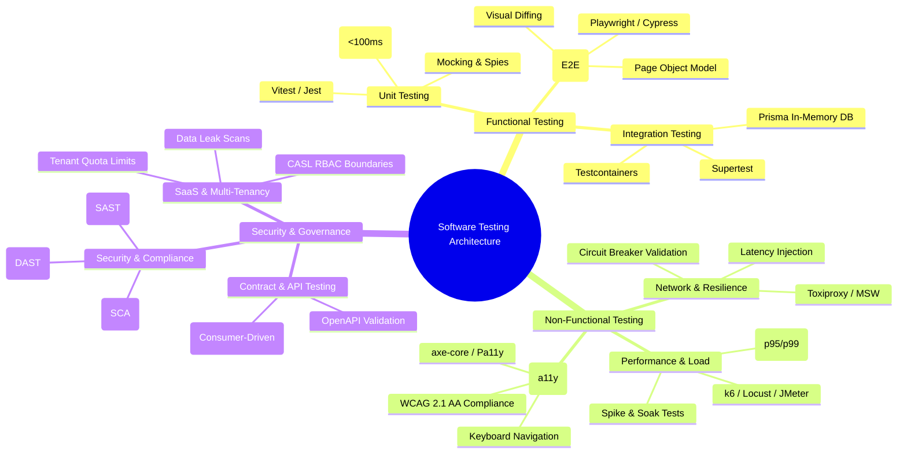

# 🧪 Software Testing Strategy, Tools, & Engineering Handbook

Welcome to the **Software Testing Strategy, Tools, & Engineering Handbook** — an enterprise-grade repository, strategic playbook, and practical reference guide for modern software quality engineering. 

This repository provides comprehensive documentation, decision frameworks, tool comparisons, and runnable code examples spanning every discipline of software testing. All patterns and case studies are grounded in real-world application architectures, with explicit references to the [`multi-tenant-saas-demo`](file:///home/empkhets0/Documents/Ankit/multi-tenant-saas-demo/README.md) monorepo system (Next.js 14, NestJS 10, Prisma ORM, Turborepo, CASL RBAC).

---

## 🗺️ Master Testing Taxonomy & Architecture



---

## 📚 Handbook Navigation & Modules

| Module | Topic | Core Tools Covered | Key Concepts |
| :--- | :--- | :--- | :--- |
| **[01. Strategy & Framework](file:///home/empkhets0/Documents/Ankit/multi-tenant-saas-demo/docs/software-testing-handbook/docs/01-testing-strategy-framework.md)** | Quality Engineering Mindset | Test Pyramids, Test Diamonds, Shift-Left | Test Data Management, Defect Taxonomies, ROI of Automation |
| **[02. Unit & Integration](file:///home/empkhets0/Documents/Ankit/multi-tenant-saas-demo/docs/software-testing-handbook/docs/02-unit-and-integration-testing.md)** | Code Level & API Testing | Vitest, Jest, Supertest, Testcontainers | Test Doubles (Mocks, Spies, Fakes), DB Rollbacks, NestJS Modules |
| **[03. E2E & Visual UI](file:///home/empkhets0/Documents/Ankit/multi-tenant-saas-demo/docs/software-testing-handbook/docs/03-e2e-and-visual-testing.md)** | Web Application & UI Flows | Playwright, Cypress, Chromatic, Percy | Page Object Model (POM), Flake Mitigation, Visual Regression |
| **[04. Load & Performance](file:///home/empkhets0/Documents/Ankit/multi-tenant-saas-demo/docs/software-testing-handbook/docs/04-load-and-performance-testing.md)** | Scalability & Latency SLAs | k6, Apache JMeter, Locust, Gatling | Ramping VUs, p95/p99 SLA Thresholds, Stress vs Spike vs Soak |
| **[05. Network & Resilience](file:///home/empkhets0/Documents/Ankit/multi-tenant-saas-demo/docs/software-testing-handbook/docs/05-network-and-chaos-testing.md)** | Chaos & Fault Injection | Toxiproxy, WireMock, MSW, Chaos Mesh | Latency Spikes, Packet Drops, Offline Mode, Retry Policies |
| **[06. Accessibility (a11y)](file:///home/empkhets0/Documents/Ankit/multi-tenant-saas-demo/docs/software-testing-handbook/docs/06-accessibility-testing.md)** | Inclusive UX & Compliance | axe-core, Pa11y, Lighthouse CI | WCAG 2.1/2.2 AA Standards, ARIA Audits, Focus Trap Tests |
| **[07. Security, SAST & DAST](file:///home/empkhets0/Documents/Ankit/multi-tenant-saas-demo/docs/software-testing-handbook/docs/07-security-and-sast-dast.md)** | DevSecOps & Vulnerabilities | SonarQube, OWASP ZAP, Semgrep, Snyk | SAST vs DAST vs SCA, Dependency Auditing, Container Scans |
| **[08. Contract & API](file:///home/empkhets0/Documents/Ankit/multi-tenant-saas-demo/docs/software-testing-handbook/docs/08-contract-and-api-testing.md)** | Microservice & Schema Assurance | Pact, OpenAPI Validator, Postman | Consumer-Driven Contracts, Breaking Schema Prevention |
| **[09. Multi-Tenant SaaS](file:///home/empkhets0/Documents/Ankit/multi-tenant-saas-demo/docs/software-testing-handbook/docs/09-multi-tenant-saas-testing.md)** | Tenant Scoping & Isolation | Vitest, Supertest, Custom Auditing | Cross-Tenant Leak Testing, CASL RBAC Guards, Quota Limits |
| **[10. Tool Selection Matrix](file:///home/empkhets0/Documents/Ankit/multi-tenant-saas-demo/docs/software-testing-handbook/docs/10-tool-selection-matrix.md)** | Executive Decision Framework | 25+ Industry Testing Tools | Comparison Matrix, Project Fit Scorecards, Tradeoffs |

---

## 🔬 Real-World Case Studies & Code Examples

### 1. Case Studies
- **[Multi-Tenant SaaS Testing Architecture](file:///home/empkhets0/Documents/Ankit/multi-tenant-saas-demo/docs/software-testing-handbook/case-studies/multi-tenant-saas-case-study.md)**: Deep dive into testing tenant isolation, RBAC role switches (`OWNER` / `ADMIN` / `MEMBER`), audit log interceptors, and metric quotas.
- **[Microservices & API Contract Testing](file:///home/empkhets0/Documents/Ankit/multi-tenant-saas-demo/docs/software-testing-handbook/case-studies/microservices-contract-testing.md)**: Contract validation using Pact between web frontends and backend services.

### 2. Runnable Code Snippets & Scripts (`examples/`)
- **[Vitest + Supertest RBAC Test](file:///home/empkhets0/Documents/Ankit/multi-tenant-saas-demo/docs/software-testing-handbook/examples/unit-integration/tenant-rbac.test.ts)**: Testing NestJS REST APIs with CASL guard authorization and header-based tenant scoping.
- **[Playwright Multi-Tenant Spec](file:///home/empkhets0/Documents/Ankit/multi-tenant-saas-demo/docs/software-testing-handbook/examples/e2e-playwright/multi-tenant-flow.spec.ts)**: Automated E2E test verifying preset persona logins and visual UI snapshots.
- **[k6 Load SLA Script](file:///home/empkhets0/Documents/Ankit/multi-tenant-saas-demo/docs/software-testing-handbook/examples/load-k6/tenant-metrics-load.js)**: Performance benchmark script asserting `<200ms` p95 response time under 500 concurrent virtual users.
- **[Network Degradation Test](file:///home/empkhets0/Documents/Ankit/multi-tenant-saas-demo/docs/software-testing-handbook/examples/network-chaos/network-degradation.test.ts)**: Testing API client retry logic and offline fallback states under injected latency.
- **[Automated WCAG a11y Audit](file:///home/empkhets0/Documents/Ankit/multi-tenant-saas-demo/docs/software-testing-handbook/examples/a11y-axe/a11y-audit.spec.ts)**: Automated page audit enforcing zero WCAG 2.1 AA violations.
- **[Consumer-Provider Pact Test](file:///home/empkhets0/Documents/Ankit/multi-tenant-saas-demo/docs/software-testing-handbook/examples/contract-pact/consumer-provider-contract.test.ts)**: Consumer-driven API contract verification example.

---

## ⚡ Quickstart: Running Example Tests

### Prerequisites
- Node.js `^20.0.0` or `v24`
- `pnpm` or `npm`
- `k6` (optional, for load testing)

```bash
# Navigate to the testing handbook directory
cd docs/software-testing-handbook

# Run Vitest unit & integration tests across api package
pnpm --filter api test

# Execute k6 load test against local backend
k6 run examples/load-k6/tenant-metrics-load.js
```
