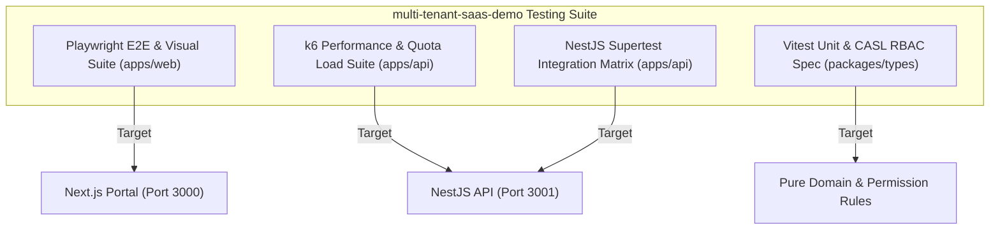

# 🔬 Case Study: Testing Architecture of `multi-tenant-saas-demo`

## 1. Executive Summary & System Overview

This case study analyzes the end-to-end software quality assurance architecture of the [`multi-tenant-saas-demo`](file:///home/empkhets0/Documents/Ankit/multi-tenant-saas-demo/README.md) project. 

The application is an enterprise-grade multi-tenant SaaS portal constructed with a modern monorepo technology stack:
- **Frontend App (`apps/web`)**: Next.js 14 (App Router), React 18, Tailwind CSS, Lucide icons.
- **Backend API (`apps/api`)**: NestJS 10 REST API, JWT Authentication, CASL-based RBAC Guards, Prisma ORM, Audit Logging Interceptor.
- **Shared Packages (`packages/`)**: `packages/types`, `packages/ui`.

---

## 2. Testing Pyramid & Test Suite Coverage

---

## 3. High-Risk Scenarios & Prevention Matrix

### Scenario 1: Cross-Tenant Data Isolation
- **Risk**: Tenant `ws-alpha` executes `GET /api/workspaces/ws-beta/metrics` with valid JWT but wrong workspace header.
- **Prevention Layer**: `NestJS TenantGuard` intercepts incoming requests, validates `x-workspace-id` against decoded JWT user claims, and rejects unauthorized tenant access with HTTP 403 Forbidden.
- **Automated Verification**: Vitest + Supertest integration suite in `examples/unit-integration/tenant-rbac.test.ts`.

### Scenario 2: RBAC Privileges (OWNER vs ADMIN vs MEMBER)
- **Risk**: A standard `MEMBER` attempts to update tenant tier or delete workspace.
- **Prevention Layer**: CASL `AbilityGuard` evaluates role permissions dynamically.
- **Automated Verification**: Integration test matrix verifying RBAC responses for every persona.

### Scenario 3: Real-Time Metrics & Quota Latency Under Load
- **Risk**: High concurrency causes telemetry queries to saturate database connections, delaying dashboard rendering.
- **Prevention Layer**: k6 load testing assertions enforcing p95 response time `<200ms` under 500 VUs.
- **Automated Verification**: `examples/load-k6/tenant-metrics-load.js`.

---

## 4. Preset Persona Login Matrix for E2E Verification

The application features three preset recruiter/demo personas on the login interface for instant zero-config E2E testing:

| Role | Persona Email | Key Privileges to Assert in Tests | Expected UI State |
| :--- | :--- | :--- | :--- |
| **Workspace Owner** | `owner@skyport.io` | Create/Delete Workspaces, Upgrade Subscription Tiers, Invite Members, View Audit Logs | All admin buttons & audit logs table visible. |
| **Workspace Admin** | `admin@skyport.io` | Invite Members, View Telemetry & Audit Logs | Invite & Audit tabs visible; Tier upgrade restricted. |
| **Standard Member** | `member@skyport.io` | Read-Only: View Overview Dashboard & Metrics | Read-only metrics cards; Invite & Settings buttons disabled. |
