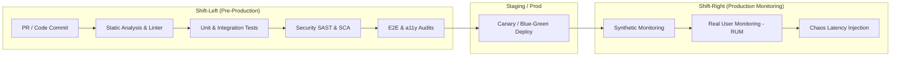

# 🎯 Chapter 1: Testing Strategy & Quality Engineering Framework

## 1. Executive Summary & Paradigm Shift

Modern software quality engineering has evolved beyond post-development QA verification into a proactive, continuous risk mitigation framework. Quality is an architectural property built into the system through automated feedback loops, shift-left testing, and automated governance gates.

---

## 2. Test Automation Models: Pyramid vs. Diamond vs. Trophy

Choosing the right testing model depends on your architecture (Monolith vs. Microservices vs. Serverless Single Page Application).

```
   Test Pyramid                    Test Diamond / Trophy
      /   \                                 / \
     / E2E \                               /   \
    /-------\                             / E2E \
   / Integr. \                           /-------\
  /-----------\                         / Integr. \
 /    Unit     \                       /           \
/---------------\                     /------------- \
                                     /  Static/Unit   \
                                    /------------------\
```

### Comparative Analysis

| Model | Primary Focus | Best Suited For | Key Advantages | Tradeoffs |
| :--- | :--- | :--- | :--- | :--- |
| **Testing Pyramid** (Mike Cohn) | Heavy reliance on fast unit tests, light E2E at apex. | Core libraries, complex domain logic engines, algorithms. | Ultra-fast feedback loop (<1ms per unit test), deterministic debugging. | Low confidence in service boundaries & UI integration wiring. |
| **Testing Diamond** | Heavy emphasis on API & service integration testing. | REST/GraphQL Microservices, Node.js/NestJS API gateways. | High confidence in system boundaries, lower maintenance than UI E2E. | Requires robust mock/in-memory database fixtures. |
| **Testing Trophy** (Guillermo Rauch / Kent C. Dodds) | Heavy emphasis on Integration & React Component tests. | Next.js App Router, modern SPA/PWA web applications. | Simulates real user behavior while maintaining high execution velocity. | Requires careful isolation to prevent slow test suites. |

---

## 3. Shift-Left & Shift-Right Testing Lifecycle

Quality engineering operates across both pre-production (Shift-Left) and live production environments (Shift-Right).



### Shift-Left Techniques
- **Pre-commit Hooks**: Husky & lint-staged executing static checks (`eslint`, `prettier`, `tsc --noEmit`).
- **PR Gating**: Blocking GitHub PR merges unless test coverage thresholds (e.g., >85% branch coverage) pass.
- **Contract Verification**: Validating API consumer contracts before merging backend changes.

### Shift-Right Techniques
- **Synthetic Monitoring**: Continuous execution of lightweight headless Playwright scripts hitting `/health` and core user flows every 5 minutes in production.
- **Feature Flags**: Decoupling code deployment from feature release using launch toggles.
- **Chaos Engineering**: Injecting latency into staging/canary microservices to verify fallback UI states.

---

## 4. Test Data Management (TDM) Strategies

A major source of test flakiness is unisolated or dirty test data. Below are four TDM patterns:

### TDM Pattern Matrix

```
1. Ephemeral In-Memory DB (SQLite/PGLite)
   ┌──────────┐      ┌─────────────────────────┐
   │ Test Run │ ───► │ In-Memory PostgreSQL    │ (Destroyed after run)
   └──────────┘      └─────────────────────────┘

2. Database Transaction Rollbacks
   ┌──────────┐      ┌──────────┐      ┌───────────────┐
   │ Begin TX │ ───► │ Run Test │ ───► │ ROLLBACK TX   │ (Zero state side-effects)
   └──────────┘      └──────────┘      └───────────────┘

3. Testcontainers (Docker Ephemeral Containers)
   ┌──────────┐      ┌─────────────────────────┐
   │ Test Run │ ───► │ Docker Postgres/Redis   │ (Spun up per suite)
   └──────────┘      └─────────────────────────┘

4. Factory Girl Pattern (TypeSafe Factories)
   createWorkspace({ name: 'Tenant A', tier: 'ENTERPRISE' });
```

---

## 5. Defect Severity & ROI Matrix

| Defect Class | Impact | SLA Target | Automated Prevention Layer |
| :--- | :--- | :--- | :--- |
| **P0 - Blocker** | Security breach, cross-tenant data exposure, payment outage. | Immediate (<1 hr) | E2E Security Audits, Tenant RBAC Integration Tests |
| **P1 - Critical** | Core flow broken (e.g., authentication failing, metrics down). | <4 hrs | E2E Playwright Flows, API Contract Testing |
| **P2 - Major** | Non-critical feature broken (e.g., export report failing). | <24 hrs | Unit & Integration Test Suites |
| **P3 - Minor** | UI alignment error, typo, minor visual glitch. | Next Sprint | Visual Regression (Chromatic), Linter Rules |
