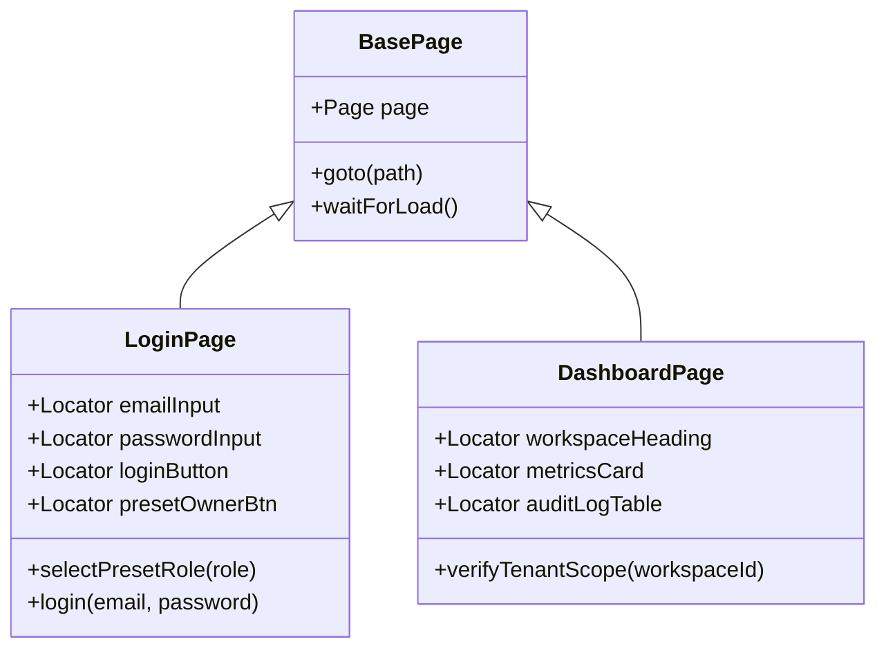

# 🎭 Chapter 3: End-to-End (E2E) & Visual UI Testing

## 1. Overview & Framework Evolution

End-to-End (E2E) testing validates full application user journeys across real browsers (Chromium, Firefox, WebKit). It ensures frontend single-page applications, client-side React state, API network calls, and UI components operate seamlessly together.

---

## 2. Tooling Comparison: Playwright vs. Cypress vs. Selenium

```
              ┌──────────────────────────────────────────┐
              │          E2E Testing Tooling             │
              └────────────────────┬─────────────────────┘
                                   │
         ┌─────────────────────────┼─────────────────────────┐
         ▼                         ▼                         ▼
  ┌──────────────┐          ┌──────────────┐          ┌──────────────┐
  │  Playwright  │          │   Cypress    │          │   Selenium   │
  │ (Microsoft)  │          │(Cypress.io)  │          │ (Open Source)│
  └──────────────┘          └──────────────┘          └──────────────┘
```

| Dimension | Playwright | Cypress | Selenium WebDriver |
| :--- | :--- | :--- | :--- |
| **Architecture** | CDP (Chrome DevTools Protocol) + BiDi WebSocket | In-browser iframe execution engine | HTTP JSON Wire Protocol / W3C WebDriver |
| **Multi-Tab & Multi-Domain** | Native support (Isolated BrowserContexts) | Restricted / Complex origin switching | Native support |
| **Execution Velocity** | ⚡ **Ultra Fast** (Parallel worker threads) | 🚀 Fast (Single tab bound) | 🐢 Moderate / Slow |
| **Cross-Browser** | Chromium, Firefox, WebKit (Safari engine) | Chromium, Firefox, Electron | All browsers (via native drivers) |
| **Auto-Waiting** | Built-in smart actionability checks | Built-in retry-ability | Manual explicit / implicit waits required |
| **Visual Regression** | Built-in `toHaveScreenshot()` | Requires plugins (Percy / Applitools) | Requires third-party tools |

---

## 3. Page Object Model (POM) Design Pattern

The Page Object Model encapsulates web page DOM selectors and user actions into clean class interfaces, keeping test specs declarative and resilient to layout changes.



### Code Example: Playwright Page Object Implementation

```typescript
// pages/LoginPage.ts
import { Page, Locator, expect } from '@playwright/test';

export class LoginPage {
  readonly page: Page;
  readonly emailInput: Locator;
  readonly passwordInput: Locator;
  readonly submitButton: Locator;
  readonly presetOwnerButton: Locator;

  constructor(page: Page) {
    this.page = page;
    this.emailInput = page.locator('input[type="email"]');
    this.passwordInput = page.locator('input[type="password"]');
    this.submitButton = page.locator('button[type="submit"]');
    this.presetOwnerButton = page.locator('button:has-text("Workspace Owner")');
  }

  async goto() {
    await this.page.goto('http://localhost:3000/login');
    await expect(this.page).toHaveTitle(/Skyport SaaS Admin Portal/);
  }

  async loginWithPresetOwner() {
    await this.presetOwnerButton.click();
    await this.submitButton.click();
    await this.page.waitForURL('**/dashboard');
  }
}
```

---

## 4. Visual Regression Testing & DOM Snapshots

Visual regression testing captures pixel-perfect screenshots of rendered components and flags unexpected visual deviations during code edits or dependencies updates.

```
       Baseline Image                    Current Image                       Diff Result
  ┌──────────────────────┐          ┌──────────────────────┐          ┌──────────────────────┐
  │  [Workspace Dashboard]│          │  [Workspace Dashboard]│          │  [Workspace Dashboard]│
  │                      │    vs    │                      │    =     │                      │
  │  ┌────────────────┐  │          │  ┌────────────────┐  │          │  ░░░░░[RED DIFF]░░░░░│
  │  │ Metrics: 1,200 │  │          │  │ Metrics: 1,450 │  │          │  ░░░░(Mismatch)░░░░░░│
  │  └────────────────┘  │          │  └────────────────┘  │          │  └────────────────┘  │
  └──────────────────────┘          └──────────────────────┘          └──────────────────────┘
```

### Playwright Visual Snapshot Code Example

```typescript
import { test, expect } from '@playwright/test';

test('Visual Regression: Admin Dashboard Glassmorphic Layout', async ({ page }) => {
  await page.goto('http://localhost:3000/dashboard');
  
  // Wait for network idle to ensure charts and metrics are hydrated
  await page.waitForLoadState('networkidle');

  // Assert pixel difference does not exceed 0.2% tolerance
  await expect(page).toHaveScreenshot('admin-dashboard-baseline.png', {
    maxDiffPixelRatio: 0.002,
    mask: [page.locator('[data-testid="realtime-timestamp"]')], // Mask dynamic timestamps
  });
});
```

---

## 5. Eliminating Test Flakiness

1. **Never Use Hardcoded Sleeps (`sleep(3000)`)**: Always leverage auto-waiting assertions like `await expect(locator).toBeVisible()`.
2. **Isolate Browser Contexts**: Create pristine browser contexts for every spec so cookies/local storage do not pollute state.
3. **Trace Viewer Debugging**: Enable `trace: 'on-first-retry'` in `playwright.config.ts` to inspect DOM snapshots, console logs, and network timelines on failure.
