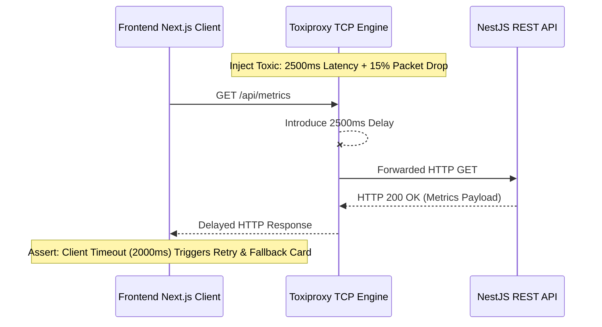

# 💣 Chapter 5: Network, Chaos, & Fault Injection Testing

## 1. Overview: Resilience in Distributed Systems

In modern distributed microservices and SaaS platforms, network partitions, transient network drops, latency spikes, and downstream service failures are inevitable. Resilience testing injects real network faults into testing environments to verify circuit breakers, retries, fallback UI states, and graceful degradation.

---

## 2. Common Network Fault Taxonomies

```
                                  Network Fault Types
                                           │
         ┌──────────────────┬──────────────┴───────┬──────────────────┐
         ▼                  ▼                      ▼                  ▼
  ┌──────────────┐   ┌──────────────┐       ┌──────────────┐   ┌──────────────┐
  │ Latency Spike│   │ Packet Drops │       │ Connection   │   │  Bandwidth   │
  │ (1000-5000ms)│   │(10%-50% drop)│       │   Reset      │   │ Throttling   │
  └──────────────┘   └──────────────┘       └──────────────┘   └──────────────┘
```

| Fault Type | Simulation Technique | Application Reaction Asserted |
| :--- | :--- | :--- |
| **Latency Injection** | Add artificial delay (e.g. 3000ms) to HTTP downstream calls. | Axios/Fetch timeout triggers fallback cached response; UI renders loading skeleton. |
| **Packet Loss** | Drop 20% of TCP packets randomly. | Retry mechanism (Exponential Backoff with Jitter) attempts request up to 3 times. |
| **TCP Connection Reset** | Inject immediate connection resets (`ECONNRESET`). | Circuit breaker transitions from CLOSED to OPEN state; fast-fails subsequent requests. |
| **Bandwidth Throttling** | Throttle throughput to 56kbps (2G Network simulation). | Progressive image loading, offline web service worker queueing. |

---

## 3. Tooling Landscape: Toxiproxy vs. MSW vs. WireMock vs. Chaos Mesh

| Feature | Shopify Toxiproxy | MSW (Mock Service Worker) | WireMock | Chaos Mesh |
| :--- | :--- | :--- | :--- | :--- |
| **Layer of Operation** | TCP Proxy Layer (L4) | Service Worker Browser/Node API Layer (L7) | HTTP Proxy / Mock Server (L7) | Kubernetes Pod/Kernel Layer (OS/K8s) |
| **Primary Focus** | Simulating raw TCP network failures (latency, drops). | Intercepting browser network calls in E2E & unit tests. | API mocking & HTTP fault injection. | Production Kubernetes Chaos Engineering. |
| **Programmatic API** | REST API & Client Libraries (JS/Go/Python) | JavaScript DOM / Service Worker | Java / JSON REST API | Kubernetes CRDs (YAML) |

---

## 4. Resilience Testing Architecture with Toxiproxy & MSW



---

## 5. Runnable Code Example: MSW Network Resilience Test

```typescript
// examples/network-chaos/network-degradation.test.ts
import { http, HttpResponse, delay } from 'msw';
import { setupServer } from 'msw/node';

// Setup Mock Service Worker server
const server = setupServer();

beforeAll(() => server.listen());
afterEach(() => server.resetHandlers());
afterAll(() => server.close());

describe('Network Resilience & Degradation Suite', () => {
  it('should trigger retry logic and succeed when 1st request times out due to injected latency', async () => {
    let callCount = 0;

    server.use(
      http.get('http://localhost:3001/api/metrics', async () => {
        callCount++;
        if (callCount === 1) {
          // Inject severe 3000ms network delay on first attempt
          await delay(3000);
          return HttpResponse.error();
        }
        // Second attempt succeeds cleanly
        return HttpResponse.json({ status: 'HEALTHY', tenantId: 'ws-100' });
      })
    );

    // Client configured with 1000ms timeout and 2 retries
    const result = await fetchWithRetry('http://localhost:3001/api/metrics', {
      timeoutMs: 1000,
      maxRetries: 2,
    });

    expect(callCount).toBe(2);
    expect(result.status).toBe('HEALTHY');
  });
});

async function fetchWithRetry(url: string, opts: { timeoutMs: number; maxRetries: number }) {
  for (let attempt = 0; attempt <= opts.maxRetries; attempt++) {
    try {
      const controller = new AbortController();
      const id = setTimeout(() => controller.abort(), opts.timeoutMs);
      const response = await fetch(url, { signal: controller.signal });
      clearTimeout(id);
      if (response.ok) return await response.json();
    } catch (err) {
      if (attempt === opts.maxRetries) throw err;
    }
  }
}
```
