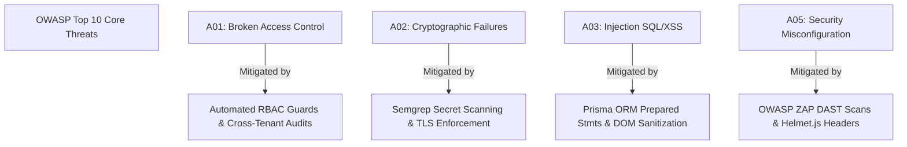

# 🔒 Chapter 7: Security Testing, SAST, DAST, & DevSecOps

## 1. Overview: The DevSecOps Paradigm

Security testing must be embedded continuously across the software development lifecycle (SDLC) rather than treated as a delayed pre-release audit. Modern DevSecOps combines static source code scanning (SAST), software composition analysis (SCA), dynamic penetration testing (DAST), and container image vulnerability audits.

---

## 2. Security Testing Spectrum: SAST vs. DAST vs. IAST vs. SCA

```
                                  Security Testing Spectrum
                                              │
         ┌──────────────────┬─────────────────┼──────────────────┬──────────────────┐
         ▼                  ▼                 ▼                  ▼                  ▼
  ┌──────────────┐   ┌──────────────┐  ┌──────────────┐   ┌──────────────┐   ┌──────────────┐
  │     SAST     │   │     SCA      │  ┌     DAST     ┐   │     IAST     │   │ Container    │
  │ Static Code  │   │ Open-Source  │  │ Dynamic API  │   │ Inside Agent │   │ Image Scan   │
  │ Analysis     │   │ Vulnerability│  │ Scanning     │   │ Monitoring   │   │ Trivy/Grype  │
  └──────────────┘   └──────────────┘  └──────────────┘   └──────────────┘   └──────────────┘
```

| Security Discipline | Target | Primary Tooling | Pipeline Stage | Example Defect Detected |
| :--- | :--- | :--- | :--- | :--- |
| **SAST (Static Application Security Testing)** | Source Code AST (TypeScript, Java, Go) | SonarQube, Semgrep, Checkmarx | PR Build / Pre-commit | Hardcoded JWT secret keys, SQL Injection vulnerabilities, unsafe `eval()`. |
| **SCA (Software Composition Analysis)** | `package.json`, `pnpm-lock.yaml`, Cargo dependencies | Snyk, Dependabot, Trivy, AuditJS | Daily Cron / CI Build | High-severity CVE in third-party npm package (e.g. vulnerable `lodash` or `express`). |
| **DAST (Dynamic Application Security Testing)** | Running HTTP REST Endpoints | OWASP ZAP, Burp Suite | Staging Deployment | XSS via unescaped URL parameter, missing CORS headers, broken authorization. |
| **Container Scanning** | Docker Base Images (`alpine`, `debian`) | Trivy, Grype, Clair | Container Registry Push | OS-level vulnerability in base Node.js alpine Linux distribution image. |

---

## 3. OWASP Top 10 Prevention Matrix



---

## 4. Semgrep Static Analysis Ruleset Example

Semgrep enables custom AST rule creation to enforce security standards across monorepos:

```yaml
# .semgrep/no-hardcoded-secrets.yml
rules:
  - id: detect-hardcoded-jwt-secrets
    patterns:
      - pattern: |
          const secret = "$SECRET_VAL";
      - regex: "(?i)(secret|jwt_key|private_key)"
    message: "CRITICAL: Detected hardcoded JWT secret key. Use process.env.JWT_SECRET."
    languages: [typescript, javascript]
    severity: ERROR

  - id: enforce-tenant-scoping-prisma
    pattern: |
      this.prisma.workspace.findMany({ where: { ... } })
    message: "WARNING: Prisma queries must include x-workspace-id tenant isolation condition."
    languages: [typescript]
    severity: WARNING
```

---

## 5. Automated DAST Scanning with OWASP ZAP in CI

Integrate OWASP ZAP baseline scanner into staging pipeline:

```bash
# Run OWASP ZAP containerized baseline scan against NestJS API
docker run -v $(pwd):/zap/wrk/:rw -t ghcr.io/zaproxy/zaproxy:stable zap-baseline.py \
    -t http://localhost:3001 \
    -c zap-rules.conf \
    -r zap-security-report.html
```
