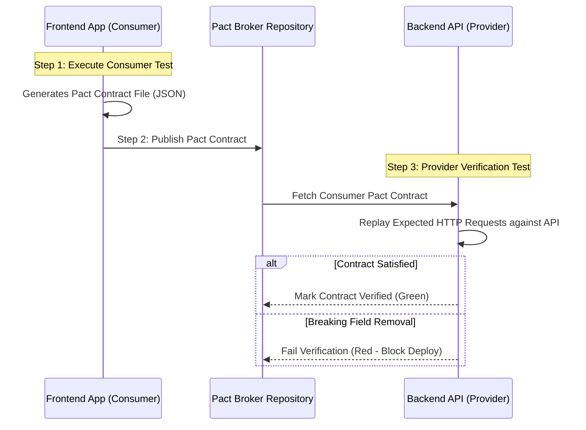

# 📜 Chapter 8: Contract & API Schema Testing

## 1. Overview: Consumer-Driven Contract Testing

In microservices and decoupled web frontend architectures (e.g. Next.js web application consuming NestJS REST APIs), breaking schema changes are a frequent source of production outages. Consumer-driven contract testing ensures backend service providers satisfy exact client expectations without requiring end-to-end multi-service deployment.

---

## 2. Consumer-Driven Contract Architecture (Pact Framework)



---

## 3. Tooling Landscape: Pact vs. OpenAPI Validator vs. Postman

| Feature | Pact Framework | OpenAPI Schema Validator | Postman Newman |
| :--- | :--- | :--- | :--- |
| **Core Paradigm** | Consumer-driven contract generation & verification. | Provider specification compliance (Swagger / OpenAPI 3.0). | Scripted HTTP endpoint assertion suites. |
| **Decoupled Verification** | ✅ Independent consumer/provider build pipelines. | Requires live running provider or mock. | Requires live running target backend. |
| **Breaking Change Alerts** | Catches missing fields, altered types, status mismatches. | Validates payload against JSON Schema definition. | Validates runtime assertion rules. |
| **Multi-Language** | TypeScript, Java, Go, Python, C#, Ruby. | Any language supporting JSON Schema. | Node.js / CLI runner. |

---

## 4. Runnable Code Example: Pact Consumer Test in TypeScript

```typescript
// examples/contract-pact/consumer-provider-contract.test.ts
import { PactV3, Matchers } from '@pact-foundation/pact';
import path from 'path';

const { like, string, regex } = Matchers;

// Initialize Pact V3 Provider Mocking Engine
const provider = new PactV3({
  consumer: 'NextWebClient',
  provider: 'NestAuthApi',
  dir: path.resolve(process.cwd(), 'pacts'),
});

describe('API Contract Suite: NextWebClient <-> NestAuthApi', () => {
  it('should verify contract for GET /api/metrics', async () => {
    provider
      .given('a valid authenticated tenant workspace session')
      .uponReceiving('a request for workspace metrics telemetry')
      .withRequest({
        method: 'GET',
        path: '/api/metrics',
        headers: {
          'Authorization': regex(/^Bearer .+$/, 'Bearer valid-jwt-token'),
          'x-workspace-id': string('ws-100'),
        },
      })
      .willRespondWith({
        status: 200,
        headers: {
          'Content-Type': 'application/json; charset=utf-8',
        },
        body: {
          tenantId: like('ws-100'),
          activeUsers: like(142),
          monthlyQuotaLimit: like(10000),
          tier: regex(/^(STARTER|PRO|ENTERPRISE)$/, 'PRO'),
        },
      });

    await provider.executeTest(async (mockServer) => {
      // Execute actual API client against Pact mock server
      const response = await fetch(`${mockServer.url}/api/metrics`, {
        headers: {
          'Authorization': 'Bearer valid-jwt-token',
          'x-workspace-id': 'ws-100',
        },
      });

      const data = await response.json();
      expect(response.status).toBe(200);
      expect(data.tenantId).toBe('ws-100');
    });
  });
});
```
