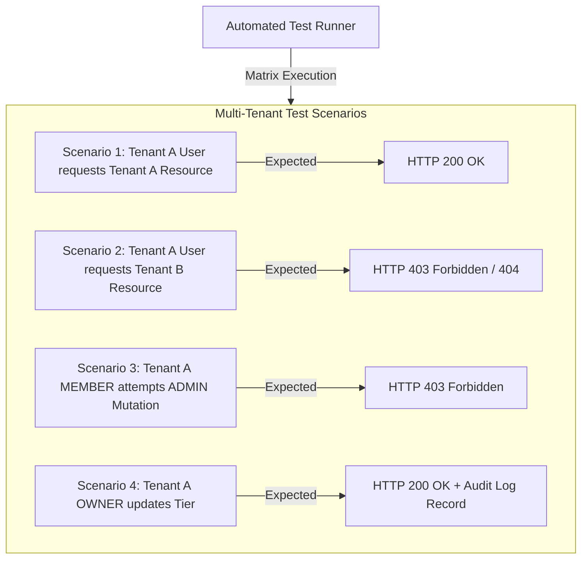

# 🏢 Chapter 9: Multi-Tenant SaaS Testing Architecture

## 1. Overview: The Multi-Tenant Quality Challenge

In multi-tenant SaaS applications (such as [`multi-tenant-saas-demo`](file:///home/empkhets0/Documents/Ankit/multi-tenant-saas-demo/README.md)), multiple customers (tenants) share common application compute instances and database infrastructure. A failure in tenant isolation constitutes a catastrophic P0 security vulnerability (Cross-Tenant Data Exposure). 

Testing multi-tenant SaaS systems requires specialized verification strategies for tenant scoping, Role-Based Access Control (RBAC/CASL) boundaries, audit logging integrity, and per-tenant rate limit enforcement.

---

## 2. Multi-Tenant Testing Dimensions

```
                            Multi-Tenant Testing Dimensions
                                           │
         ┌──────────────────┬──────────────┴───────┬──────────────────┐
         ▼                  ▼                      ▼                  ▼
  ┌──────────────┐   ┌──────────────┐       ┌──────────────┐   ┌──────────────┐
  │ Tenant Data  │   │  RBAC/ABAC   │       │ Operational  │   │ Per-Tenant   │
  │  Isolation   │   │ Boundaries   │       │  Audit Trail │   │ Quota Limit  │
  └──────────────┘   └──────────────┘       └──────────────┘   └──────────────┘
```

| Dimension | Risk Scenario | Automated Test Strategy |
| :--- | :--- | :--- |
| **Tenant Data Scoping** | Tenant A queries `/api/workspaces` and receives records belonging to Tenant B due to missing `WHERE workspaceId = x` clause. | Automated matrix test injecting foreign `x-workspace-id` headers and asserting `403` or empty payloads. |
| **RBAC Role Matrix** | A `MEMBER` user calls `DELETE /api/members/usr-5` and succeeds because authorization check was skipped. | Matrix testing asserting `OWNER` vs `ADMIN` vs `MEMBER` privileges across all REST endpoints. |
| **Audit Log Integrity** | User actions fail to emit immutable audit logs containing IP address, action type, and payload metadata. | Interceptor unit & integration tests asserting Prisma audit record creation on state mutations. |
| **Quota Enforcement** | Tenant on `STARTER` tier exceeds API quota limits without getting HTTP 429 Too Many Requests. | k6 load scripts firing concurrent requests exceeding tier quota limits. |

---

## 3. RBAC & Data Isolation Test Matrix Flow



---

## 4. Integration Test Code Example: Tenant Isolation & CASL RBAC

```typescript
// examples/unit-integration/tenant-rbac.test.ts
import { describe, it, expect, beforeEach } from 'vitest';
import request from 'supertest';
import { createMockApp } from '../test-helpers';

describe('Multi-Tenant Data Isolation & CASL RBAC Matrix', () => {
  let app: any;

  beforeEach(async () => {
    app = await createMockApp();
  });

  const tenants = {
    tenantA: { id: 'ws-tenant-alpha', name: 'Alpha Corp' },
    tenantB: { id: 'ws-tenant-beta', name: 'Beta LLC' },
  };

  const users = {
    ownerAlpha: { token: 'jwt-alpha-owner', role: 'OWNER', tenantId: tenants.tenantA.id },
    memberAlpha: { token: 'jwt-alpha-member', role: 'MEMBER', tenantId: tenants.tenantA.id },
    ownerBeta: { token: 'jwt-beta-owner', role: 'OWNER', tenantId: tenants.tenantB.id },
  };

  it('P0: Prevent Cross-Tenant Data Leakage (Tenant Alpha user accessing Tenant Beta resource)', async () => {
    const res = await request(app)
      .get('/api/workspaces/metrics')
      .set('Authorization', `Bearer ${users.ownerAlpha.token}`)
      .set('x-workspace-id', tenants.tenantB.id); // Injected cross-tenant workspace header

    expect(res.status).toBe(403);
    expect(res.body.message).toMatch(/Tenant isolation breach detected/i);
  });

  it('RBAC Enforcement: MEMBER should be blocked from inviting new team members', async () => {
    const res = await request(app)
      .post('/api/workspaces/members/invite')
      .set('Authorization', `Bearer ${users.memberAlpha.token}`)
      .set('x-workspace-id', tenants.tenantA.id)
      .send({ email: 'newdev@alpha.com', role: 'MEMBER' });

    expect(res.status).toBe(403);
    expect(res.body.message).toContain('Insufficient privilege');
  });

  it('Audit Logging: State-modifying action by OWNER must generate immutable audit record', async () => {
    const res = await request(app)
      .patch('/api/workspaces/tier')
      .set('Authorization', `Bearer ${users.ownerAlpha.token}`)
      .set('x-workspace-id', tenants.tenantA.id)
      .send({ tier: 'ENTERPRISE' });

    expect(res.status).toBe(200);

    // Verify audit log side-effect
    const auditLogs = await request(app)
      .get('/api/audit-logs')
      .set('Authorization', `Bearer ${users.ownerAlpha.token}`)
      .set('x-workspace-id', tenants.tenantA.id);

    expect(auditLogs.body.data[0]).toMatchObject({
      action: 'WORKSPACE_TIER_UPDATED',
      workspaceId: tenants.tenantA.id,
      actorRole: 'OWNER',
    });
  });
});
```
