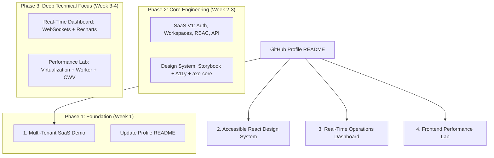

# Recruiter Showcase Portfolio Implementation Plan

This plan outlines the architecture, roadmap, and step-by-step deliverables for creating **4 recruiter-focused demo repositories** and integrating them into your GitHub profile README (`ankit-amar-singh`).

The goal is to demonstrate senior-level engineering leadership, full-stack enterprise architecture, accessibility mastery, real-time application design, and frontend performance optimization to recruiters and engineering managers.

---

## Portfolio Strategy & Recommended Roadmap



---

## User Review Required

> [!IMPORTANT]
> **Key Architecture Decisions for Review:**
> 1. **Repository Structure for SaaS Demo**: Recommend a **Turborepo monorepo** (`multi-tenant-saas-demo`) containing `apps/web` (Next.js 14 App Router), `apps/api` (NestJS), `packages/ui`, `packages/config`, and `packages/types`. This showcases modern enterprise monorepo management.
> 2. **Authentication & Authorization**: JWT-based auth with refresh token rotation + CASL / RBAC (`owner`, `admin`, `member`) for workspace context.
> 3. **Database & ORM**: PostgreSQL with Prisma ORM running via Docker Compose for easy zero-config local reproduction.
> 4. **Live Deployments**: Vercel for Next.js apps & Storybook, Render/Fly.io/Railway for NestJS backend & PostgreSQL.

---

## Open Questions

> [!NOTE]
> 1. **Immediate Execution Priority**: Would you like to start immediately with **Phase 1: Profile README update** and **Phase 2: Scaffolding the `multi-tenant-saas-demo` monorepo**, or would you like to review/adjust the technology stack first?
> 2. **Target Location for Repositories**: Should the new repositories be initialized in adjacent directories under your workspace (e.g., `/home/empkhets0/projects/` or `/home/empkhets0/Documents/Ankit/`)?

---

## Proposed Changes

---

### Component 1: GitHub Profile README Update

#### [MODIFY] [`README.md`](file:///home/empkhets0/Documents/Ankit/ankit-amar-singh/README.md)
Add a prominent **🚀 Engineering Demonstrations** section near the top of your profile README right after your highlights, placing live working code front and center for recruiters before detailed employment history.

```markdown
## 🚀 Engineering Demonstrations

### 1. 🏢 [Multi-Tenant SaaS Demo](https://github.com/ankit-amar-singh/multi-tenant-saas-demo)
> **Stack**: Next.js 14 (App Router), TypeScript, NestJS, PostgreSQL, Prisma, Docker, GitHub Actions  
Enterprise-grade multi-tenant platform with workspace isolation, CASL-based RBAC (Owner/Admin/Member), JWT authentication, usage metrics dashboard, REST API, and full Docker orchestration.  
- 🔗 **Live Demo**: [saas-demo.vercel.app](https://saas-demo.vercel.app) | 📖 **Architecture Docs**: [ADRs & Diagrams](https://github.com/ankit-amar-singh/multi-tenant-saas-demo/tree/main/docs)

### 2. ♿ [Accessible React Design System](https://github.com/ankit-amar-singh/accessible-react-design-system)
> **Stack**: React 18, TypeScript, Storybook 8, Vitest, Testing Library, Playwright, axe-core  
WCAG 2.1 AA compliant component library featuring keyboard navigation, focus trap management, dark mode token system, automated `axe-core` accessibility testing, and interactive Storybook docs.  
- 🔗 **Storybook Docs**: [design-system.vercel.app](https://design-system.vercel.app)

### 3. ⚡ [Real-Time Operations Dashboard](https://github.com/ankit-amar-singh/real-time-operations-dashboard)
> **Stack**: Next.js, NestJS, WebSockets (Socket.io / SSE), Recharts, Redis, Docker  
High-frequency telemetry dashboard rendering real-time device metrics with automatic reconnection logic, virtualized log feeds, dynamic filtering, and resilient state management.

### 4. 🧪 [Frontend Performance Lab](https://github.com/ankit-amar-singh/frontend-performance-lab)
> **Stack**: Next.js, React 18, Web Workers, Bundle Analyzer, Lighthouse CI  
Interactive lab demonstrating optimization strategies: large list virtualization, off-main-thread Web Worker data processing, dynamic code splitting, and measurable Core Web Vitals improvements with before/after benchmarks.
```

---

### Component 2: Demo 1 — Multi-Tenant SaaS Admin Portal (`multi-tenant-saas-demo`)

#### [NEW] Repository Structure (`multi-tenant-saas-demo`)

```text
multi-tenant-saas-demo/
├── apps/
│   ├── web/                     # Next.js 14 App Router + Tailwind CSS + Shadcn UI
│   │   ├── app/
│   │   │   ├── (auth)/login/
│   │   │   ├── (dashboard)/[workspaceSlug]/
│   │   │   │   ├── overview/
│   │   │   │   ├── members/
│   │   │   │   ├── settings/
│   │   │   │   └── audit-logs/
│   │   └── lib/api-client.ts
│   └── api/                     # NestJS 10 REST API
│       ├── src/
│       │   ├── auth/            # JWT, bcrypt, Auth Guards
│       │   ├── workspaces/      # Multi-tenant context & tenant isolation middleware
│       │   ├── users/           # User management & roles (Owner, Admin, Member)
│       │   ├── audit/           # Audit logging interceptor
│       │   ├── metrics/         # Aggregated usage metrics & analytics
│       │   └── prisma/          # Prisma schema & database service
│       └── test/                # E2E Supertest integration tests
├── packages/
│   ├── ui/                      # Shared component primitives
│   ├── config/                  # Shared ESLint, Prettier, TypeScript configs
│   └── types/                   # Shared DTOs and API response interfaces
├── docs/
│   ├── architecture.md          # Architecture overview & component diagram
│   └── decisions/               # Architecture Decision Records (ADRs)
│       ├── 001-use-postgresql-prisma.md
│       ├── 002-jwt-auth-tenant-isolation.md
│       └── 003-casl-rbac-authorization.md
├── .github/
│   └── workflows/
│       ├── ci.yml               # Lint, Typecheck, Unit Tests, E2E Tests
│       └── deploy.yml           # Automated deployment workflow
├── docker-compose.yml           # Local setup: Postgres + NestJS API + Next.js App
├── README.md                    # Comprehensive, recruiter-ready README
└── turbo.json                   # Turborepo task pipeline
```

#### Feature Milestones for SaaS Demo:
- **Version 1 (Core Foundations)**:
  - User registration & JWT authentication (Access Token + Refresh Token).
  - Workspace creation & active workspace switcher dropdown.
  - Role-based Access Control (RBAC/CASL): `Owner`, `Admin`, `Member`.
  - Member invitations & permission enforcement on API endpoints.
  - Workspace Overview Dashboard with mock system usage metrics.
  - Fully responsive, accessible dark/light mode UI.
  - Comprehensive Unit & E2E Integration tests with Vitest & Supertest.
- **Version 2 (Enterprise Extensions)**:
  - Audit logging middleware tracking user actions (login, role update, invites).
  - Mock subscription tiers (Free, Pro, Enterprise) with feature gate enforcement.
  - Background job queue (BullMQ/Redis or async handlers) for email notifications.
- **Version 3 (Ops & Documentation)**:
  - Docker Compose single-command launch (`docker-compose up`).
  - Architecture documentation & 3 ADRs.
  - GitHub Actions CI pipeline running lint, build, test, and typecheck.

---

### Component 3: Demo 2 — Accessible React Design System (`accessible-react-design-system`)

#### [NEW] Repository Structure (`accessible-react-design-system`)

```text
accessible-react-design-system/
├── .storybook/                  # Storybook configuration & A11y addon setup
│   ├── main.ts
│   └── preview.ts
├── src/
│   ├── components/
│   │   ├── Button/              # Button with focus-visible & ARIA states
│   │   ├── Modal/               # Dialog with focus trap & ESC listener
│   │   ├── Dropdown/            # Listbox with ARIA keyboard navigation
│   │   ├── Input/               # Accessible form control with error messaging
│   │   ├── Table/               # Sortable accessible data table
│   │   ├── Toast/               # ARIA live region notifications
│   │   └── Pagination/          # Navigational pagination with ARIA labels
│   ├── tokens/                  # Theme tokens (colors, typography, spacing, dark mode)
│   └── hooks/                   # Focus trap, keyboard navigation, dynamic ID hooks
├── tests/
│   ├── a11y/                    # axe-core automated accessibility suite
│   ├── unit/                    # Vitest + React Testing Library component tests
│   └── e2e/                     # Playwright cross-browser & keyboard navigation tests
├── .github/workflows/
│   └── storybook-deploy.yml     # Automated deploy to Vercel/GitHub Pages
├── README.md                    # Detailed README with WCAG compliance checklist
└── package.json
```

#### Key Highlights for Recruiters:
- 100% WCAG 2.1 AA Compliance verified by `@axe-core/react` & Storybook `addon-a11y`.
- Keyboard navigation (Tab, Shift+Tab, Arrow Keys, Esc, Space, Enter) built-in.
- Focus trap and focus restore implementation for Modal and Dropdown dialogs.
- Storybook 8 documentation site with live props control, dark mode toggle, and design tokens.

---

### Component 4: Demo 3 — Real-Time Operations Dashboard (`real-time-operations-dashboard`)

#### Feature Overview & Architecture:
- Real-time telemetry connection via WebSockets (Socket.io / Server-Sent Events).
- Resilient client handling: auto-reconnect with exponential backoff, visual connection indicator (Connected / Reconnecting / Offline).
- Interactive dashboard charts built with Recharts / ECharts for memory usage, throughput, and node health.
- Virtualized live log stream with real-time text search and filter by severity (`INFO`, `WARN`, `ERROR`).
- Dockerized setup with mock telemetry generator service.

---

### Component 5: Demo 4 — Frontend Performance Lab (`frontend-performance-lab`)

#### Feature Overview & Architecture:
- **Case 1: Large List Virtualization**: Un-virtualized 10,000 DOM nodes vs `@tanstack/react-virtual` list (FPS, DOM node count, paint time).
- **Case 2: Heavy Calculation in Web Worker**: Heavy dataset sorting/filtering freezing main UI thread vs offloaded to Web Worker.
- **Case 3: Image Optimization & Lazy Loading**: Native un-optimized images vs Next.js Image with WebP/AVIF dynamic scaling.
- **Case 4: Bundle Optimization & Code Splitting**: Monolithic bundle vs Dynamic Imports (`React.lazy` / `next/dynamic`).
- Deliverables include interactive before/after toggle, Lighthouse CI score comparison, and Profiler metrics.

---

## 4-Week Implementation Plan Timeline

| Week | Target Focus | Key Deliverables |
| :--- | :--- | :--- |
| **Week 1** | **Profile README & SaaS Demo Setup** | Update profile README; setup Turborepo for `multi-tenant-saas-demo`; configure Next.js, NestJS, Postgres, and Docker Compose; build Auth & JWT logic. |
| **Week 2** | **SaaS Demo Core Features** | Implement Workspaces, RBAC/CASL permissions, Workspace Switcher, Dashboard UI, REST API endpoints, and initial unit/integration tests. |
| **Week 3** | **SaaS Polish & Design System** | Add SaaS Audit Logs, ADRs, GitHub Actions CI; launch `accessible-react-design-system` with Storybook & axe-core tests. |
| **Week 4** | **Real-Time Dashboard & Perf Lab** | Implement `real-time-operations-dashboard` (WebSockets) and `frontend-performance-lab`; publish live demos; add GIFs/screenshots to all READMEs. |

---

## Verification Plan

### Automated Verification
1. **Linting & Type Checking**:
   - `npm run lint` across all apps and packages in monorepo.
   - `tsc --noEmit` strict type checking.
2. **Unit & Integration Testing**:
   - NestJS API controller & service tests using Vitest (`npm run test:unit`).
   - Supertest API integration tests against isolated PostgreSQL test database (`npm run test:e2e`).
   - React component unit tests using React Testing Library (`npm run test`).
3. **Accessibility Auditing**:
   - Automated `axe-core` accessibility assertions (`npm run test:a11y`).
4. **Build & Containerization**:
   - `docker-compose up --build` verification for single-command start.
   - Production bundle build (`npm run build`).

### Manual Verification
1. Verify profile README rendered markdown and link accuracy.
2. Test user experience flow on live demos (Register -> Create Workspace -> Invite Member -> Switch Workspace -> View Metrics -> Inspect Audit Logs).
